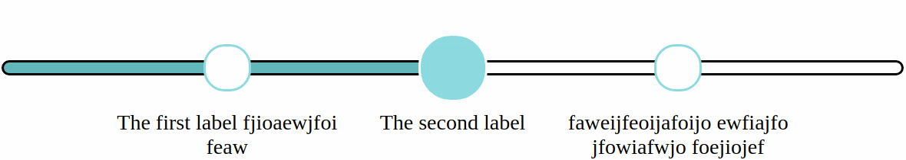

# progress-bar-with-steps
Scalable, pure CSS progress bar with a variable number of steps and a customizable color palette

## Install

### npm
```
npm install progress-bar-with-steps --save
```
```javascript
const stepBar = require('progress-bar-with-steps');

stepBar.initProgressBars();
```

### Browser
Put this on your page:
```html
<script src="https://unpkg.com/progress-bar-with-steps@latest/dist/index.min.js" type="text/javascript"></script>
<script>
  initProgressBars();
</script>
```

## Usage
Create a progress bar in your HTML and pass in optional parameters.

### Example
```html
<div class='steps-bar'
  data-num-steps="3" 
  data-current-step="2" 
  data-complete="false"
  data-animation-duration="1.5"
  data-text-color="black"
  data-label-text-1="The first label fjioaewjfoifeaw"
  data-label-text-2="The second label"
  data-label-text-3="faweijfeoijafoijo ewfiajfo jfowiafwjo foejiojef"
  data-bar-border="black"
  data-scale="1.75"
  data-key="0">
</div>
```


### Reference
- `data-num-steps` - Number of steps (milestones, checkpoints) along progress bar
- `data-current-step` - Current step on progress bar. This step's circle will be slightly larger and have a different coloration.
- `data-incomplete-color` - Color of fragments of bar that are not complete (after current step).
- `data-complete-color-primary` - Primary color of fragments of bar that are complete (before current step).
- `data-complete-color-secondary` - Secondary color of fragments of bar that are complete (before current step).
- `data-animation-duration` - Duration (in seconds) of gradient animation between primary and secondary colors of complete bar fragments.
- `data-circle-primary` - Fill color of non-current circles and border color of current circle.
- `data-circle-secondary` - Border color of non-current circles and fill color of current circle.
- `data-text-color` - Color of label text.
- `data-label-text-[i]` - Label text for step i on the progress bar.
- `data-bar-border` - Optional color of border around bar.
- `data-scale` - Scaling factor for all part of progress bar.
- `data-key` - Unique key for progress bar. IMPORTANT: Must be included if using multiple progress bars.
- `data-complete` - If true, entire bar will be treated as completed.

## License
MIT